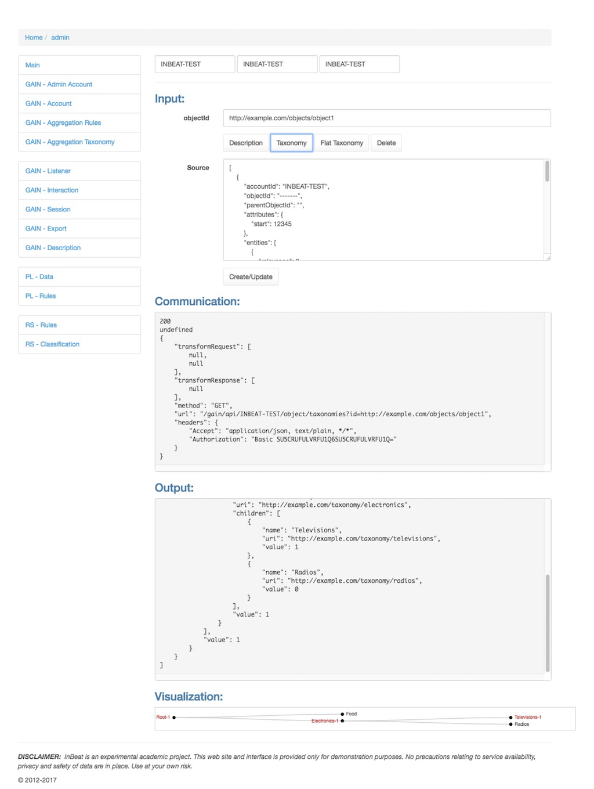

# InBeat - Web-based Admin console
This web page provides the documentation of the InBeat admin console:

## Sections

All administration activities require providing the following credentials:

- accountId
- username
- password

For the testing/demonstration examples you can fill in account identifier ``INBEAT-TEST``, username and password ``INBEAT-TEST:INBEAT-TEST``.

### GAIN - General Analytics INterceptor

- Admin Account
  - Administration of all available accounts on the InBeat. Main admin credentials are configured in (./inbeat/config.js). 

Example of the test account:
```json
[
    {
        "id": "INBEAT-TEST",
        "status": "verified",
        "sessionization": 30,
        "credentials": "INBEAT-TEST:INBEAT-TEST"
    }
]
```

- Account 
  - Administration of the specific account

Example:
```json
[
    {
        "id": "INBEAT-TEST",
        "status": "verified",
        "sessionization": 30,
        "credentials": "INBEAT-TEST:INBEAT-TEST"
    }
]
```

- Aggregation Rules
  - Configuration of aggregation rules - currently in the form of JavaScript code

Example:
```json
{
  "body": "if(interaction.attributes.action===\"like\") {aggregation.interest = 1;} else {aggregation.interest = -1;} "
}
```

- Aggregation Taxonomy 
  - Configuration of the aggregation taxonomy + visualization

Example:
```json
{
  "name": "Root",
  "uri": "http://example.com/taxonomy/root",
  "children": [{
      "name": "Food",
      "uri": "http://example.com/taxonomy/food"
    },{
      "name": "Electronics",
      "uri": "http://example.com/taxonomy/electronics",
      "children": [{
        "name": "Televisions",
        "uri": "http://example.com/taxonomy/televisions"
      },{
        "name": "Radios",
        "uri": "http://example.com/taxonomy/radios"
      }]
    }
  ]
}
```

- Listener
  - Interface for sending specific user interactions

Example:
```json
{
  "accountId": "INBEAT-TEST",
  "type": "event",
  "attributes":{
    "action":"like"
  },
  "userId": "http://example.com/users/user1",
  "objectId": "http://example.com/objects/object1",
  "object":{
    "objectId":"http://example.com/objects/object1",
    "entities":[{
      "entityURI":"http://dbpedia.org/resource/Television",
      "typeURI":"http://example.com/taxonomy/televisions"
    }]
  }
}
```

- Interaction
  - Export of interactions - all or user specific
  - Statistics about user interactions
  - Delete all interactions
- Session
  - Statistics about sessions - all or user specific
- Export
  - Export of all aggregated interactions - all or user specific
    - JSON, CSV or MySQL formats
  - Delete aggregations

Example of CSV export:
```csv
accountId;objectId;parentObjectId;sessionId;userId;interest;type_Root;type_Electronics;type_Televisions;entity_Television;last;type_Food;entity_Onion
INBEAT-TEST;http://example.com/objects/object1;0;1493141903025;http://example.com/users/user1;1;1;1;1;1;1493141903072;0;0
INBEAT-TEST;http://example.com/objects/object2;0;1493141903025;http://example.com/users/user1;-1;1;0;0;0;1493141903119;1;1
```

- Description
  - Management of objects' descriptions 
  - Create/Update/Delete specific object description
  - Read and visualize description, taxonomy or flattened taxonomy

Example:
```json
[
    {
        "accountId": "INBEAT-TEST",
        "objectId": "http://example.com/objects/object1",
        "entities": [
            {
                "typeURI": "http://example.com/taxonomy/televisions",
                "entityURI": "http://dbpedia.org/resource/Television"
            }
        ]
    }
]
```

### PL - Preference Learning

- Data
  - Importing aggregated data - manually provided or exported from GAIN
- Rules
  - Preference learning interface
    - Allows configuration of algorithm (e.g. JS based apriori, arules), setting minimum confidence, minimum support and optionally target variable (to appear on the right-hand side of the rule)

Example:
```json
[
    {
        "antecedent": {
            "entity_Onion": "1"
        },
        "consequent": {
            "interest": "negative"
        },
        "support": 0.5,
        "confidence": 1,
        "text": "{entity_Onion=1} => {interest=negative}"
    }
]
```

### RS - Recommender System
- Rules
  - Importing preference rules - manually provided or exported from PL
- Classification
  - Interface for labeling specific objects that already exists in the system. Manually defined description can be also used for ad-hoc experiments with specific preferences. 

Example:
```json
[{"objectId":"http://example.com/objects/object3","rank":"negative","confidence":1}]
```

## Screenshots - Examples

### Propagation visualization in the admin console


### Preference learning


